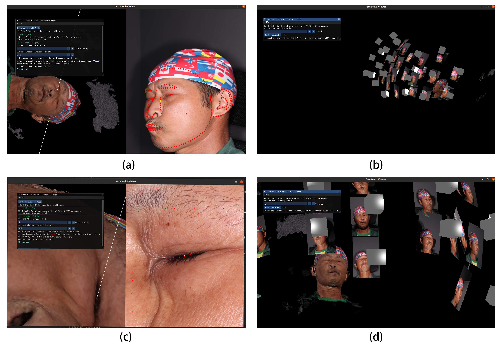

# Face Multiviewer

Face Multiviwer提供24个视图下与目标模型的可视化显示，并且能够对单视图的二维人脸特征点进行修改并保存。



## 特点

* 全局模式 (见图(b)(d))

    * 24个相机位置及对应拍摄图片与目标重建模型的三维关系

* 单视图模式 (见图(a)(c))

    * 左窗口：三维视角

        * 重建的目标模型

        * 白色射线表示用户选中的二维特征点投影的三维射线

    * 右窗口：二维视角

        * 指定视角的图像

        * 红色特征点表示该视角下的二维特征点

        * 黄色特征点表示用户选中的二维特征点

## 使用

### 依赖库

* Assimp

* GLFW (OpenGL)

* Boost

### 开始

```shell
./face_multiviewer 目标目录/
```

### 按键说明

#### 全局模式

通过UI界面输入框输入目标视角序号，点击`Edit Landmarks`跳转。

#### 单视角模式

通过UI界面输入框输入目标视角序号即可跳转。

通过UI界面输入框输入或使用`鼠标左键`点击即可选中目标二维特征点，选中后该特征点由红色变成黄色，右侧二维视角将放大到该特征点的周围（使用`鼠标右键`可以返回）。

选中目标特征点后，可以通过`WSAD`进行特征点对应的上下左右移动。

修改特征点结束后，通过UI界面点击`Save Landmarks`即可保存至原特征点相同目录下并覆盖原特征点文件，原特征点数据将另存为`特征点序号_当前时间.backup`的格式。


